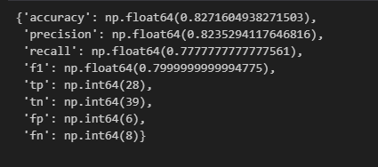
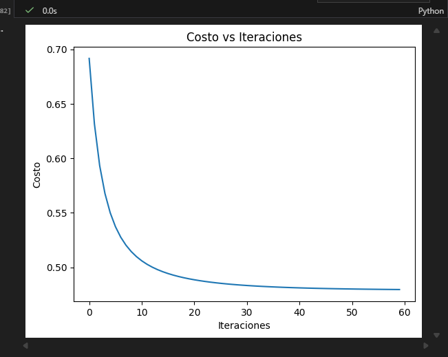
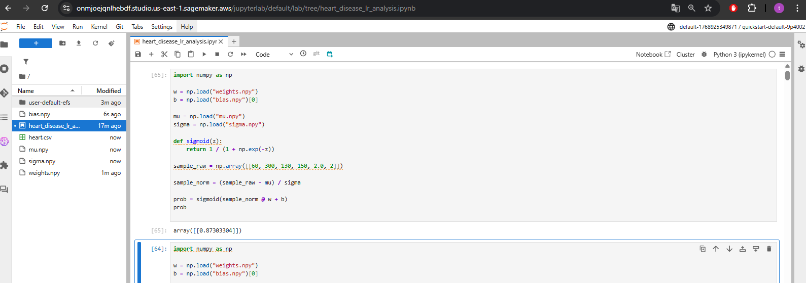
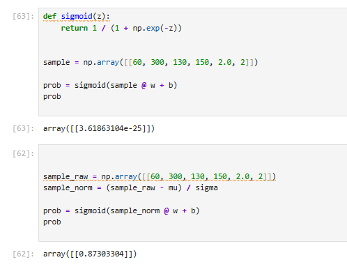

## Heart-Disease-Risk-Prediction-Logistic-Regression-Homework---Tomas-Espitia
Tarea N2 TDSI
Este proyecto implementa un modelo de regresión logística desde cero para la predicción del riesgo de enfermedad cardíaca a partir de variables clínicas. El objetivo principal es comprender y aplicar todas las etapas de un flujo de aprendizaje automático, incluyendo el análisis exploratorio de los datos, el preprocesamiento, el entrenamiento, la evaluación del modelo, la visualización de las fronteras de decisión, la regularización y una implementación exploratoria en la nube mediante Amazon SageMaker.

El modelo se entrena con un conjunto de datos clínicos reales y prioriza la interpretabilidad, lo que lo convierte en una herramienta adecuada como sistema de apoyo a la toma de decisiones en contextos sanitarios.

## Empezando

Estas instrucciones permiten obtener una copia del proyecto en funcionamiento en el equipo local para fines de desarrollo y pruebas. Para la implementación del proyecto en un entorno de ejecución en la nube utilizando Amazon SageMaker, se recomienda consultar la sección de Despliegue.

## Prerrequisitos

Para ejecutar este proyecto es necesario contar con los siguientes requisitos:

- Python 3.9 o superior

- Git

## Librerías necesarias

pip install numpy pandas matplotlib

## Instalación

- Paso 1: Clonar el Respositorio: git clone https://github.com/tu_usuario/heart-disease-logistic-regression.git
cd heart-disease-logistic-regression

- Paso 2: instalar dependencia: pip install numpy pandas matplotlib

- Paso 3 :Ejecutar el NoteBook

## Ejecutando las pruebas 

El proyecto evalúa el desempeño del modelo utilizando métricas estándar de clasificación binaria.

Pruebas de extremo a extremo
Estas pruebas permiten evaluar el funcionamiento completo del modelo, desde la carga y preprocesamiento de los datos hasta la generación de predicciones sobre el conjunto de prueba. Para esta evaluación se utilizan métricas como accuracy, precision, recall y F1-score, las cuales permiten medir de forma integral el desempeño del clasificador.

## Pruebas de estabilidad y convergencia

Estas pruebas permiten evaluar la estabilidad del entrenamiento y verificar la correcta convergencia del algoritmo de descenso por gradiente mediante el seguimiento del valor de la función de costo a lo largo de las iteraciones.

## Despliegue

Como ejercicio exploratorio de implementación en la nube, el modelo entrenado fue exportado y cargado en Amazon SageMaker Studio utilizando JupyterLab. Para realizar inferencias sobre nuevos datos clínicos se emplearon tanto los parámetros del modelo (weights.npy y bias.npy) como los parámetros de normalización (mu.npy y sigma.npy).

Como demostración, se evaluó un paciente de ejemplo con características clínicas representativas, como una edad de 60 años y un nivel de colesterol de 300, obteniéndose una probabilidad elevada de presentar enfermedad cardíaca. Este resultado evidencia la viabilidad del modelo como un sistema de puntuación de riesgo en tiempo real, con tiempos de respuesta del orden de milisegundos.

El modelo entrenado fue exportado y cargado en Amazon SageMaker Studio utilizando JupyterLab a través de archivos NumPy (weights.npy y bias.npy). Para mantener la consistencia entre el entrenamiento y el despliegue, también se cargaron los parámetros de normalización (mu.npy y sigma.npy), los cuales se aplicaron al vector de entrada antes de realizar la inferencia.

Como prueba, se evaluó un paciente con valores clínicos representativos (edad = 60, colesterol = 300, presión arterial = 130, frecuencia cardíaca máxima = 150, depresión del ST = 2.0 y número de vasos = 2). Luego de normalizar las variables, el modelo arrojó una probabilidad de 0.873, lo que indica un riesgo alto de enfermedad cardíaca. Este resultado demuestra la viabilidad del modelo para un flujo de puntuación de riesgo en tiempo real dentro de un entorno cercano a producción.

## Construido con

- Python
- NumPy
- Pandas
- Matplotlib
- Amazon SageMaker Studio

## Autores
- Tomas Espitia Quiroga

## Agradecimientos

Se expresa un agradecimiento especial al profesor del curso por la orientación académica, el acompañamiento durante el desarrollo de la Tarea y el énfasis en la comprensión de los fundamentos teóricos y prácticos del aprendizaje automático.

Asimismo, se agradece a la Escuela Colombiana de Ingeniería Julio Garavito por proporcionar el entorno académico, los recursos y la formación necesarios para la realización de este trabajo, promoviendo el pensamiento crítico y la aplicación de la ingeniería a la solución de problemas del mundo real.

